# bank-marketing-strategy-analysis

Hi there! I am Jace. This was my final project of `Categorical Data Analysis` when I major *Applied Statistics* at Central University of Finance and Economics(CUFE) in 2020 fall.
- [code](code) contains:
    - [Data Processing](code/1_data_processing.Rmd): Everything before data goes into model. I combined the Exploration Data Analysis with the feature engineering process.
    - [Logistics model](code/2.1_model_logistic_regression.Rmd), [SVM model](code/2.2_model_SVM.Rmd), and [Decision Tree model](code/2.3_model_decision_tree.R) are applied.
    - [funcs](code/funcs.R) contains commonly used function across the codes.
- [data](data) contains:
    - the original data downloaded at [UCI Bank Marketing Data Set](https://archive.ics.uci.edu/ml/datasets/Bank+Marketing),
    > [Moro et al., 2011] S. Moro, R. Laureano and P. Cortez. Using Data Mining for Bank Direct Marketing: An Application of the CRISP-DM Methodology. 

    - and some in-progress data stored in RData format to communicate with my teammates.
- [images](images) and [tables](tables) output used to write the report

Note: The **[Report](report_chinese.pdf)** is written in Chinese, but it contains some fancy charts I created, so you can still take a look. Also, I will elaborate on the may idea in the following README page. 

## Goal

1. Forecast the success rate of the telemarketing calls, given information of target customers and the campaign records.

2. Customer profiling for a effective marketing strategy.

## Data Preparation

### Data explore

#### Discrete variables

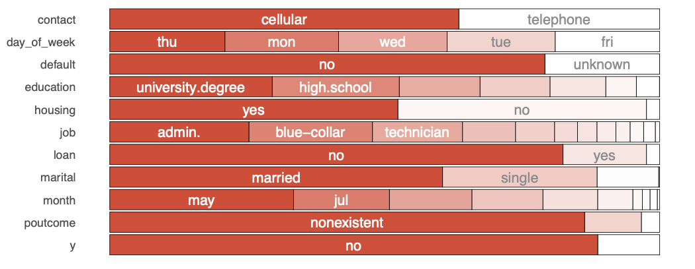

- Personal Information:

    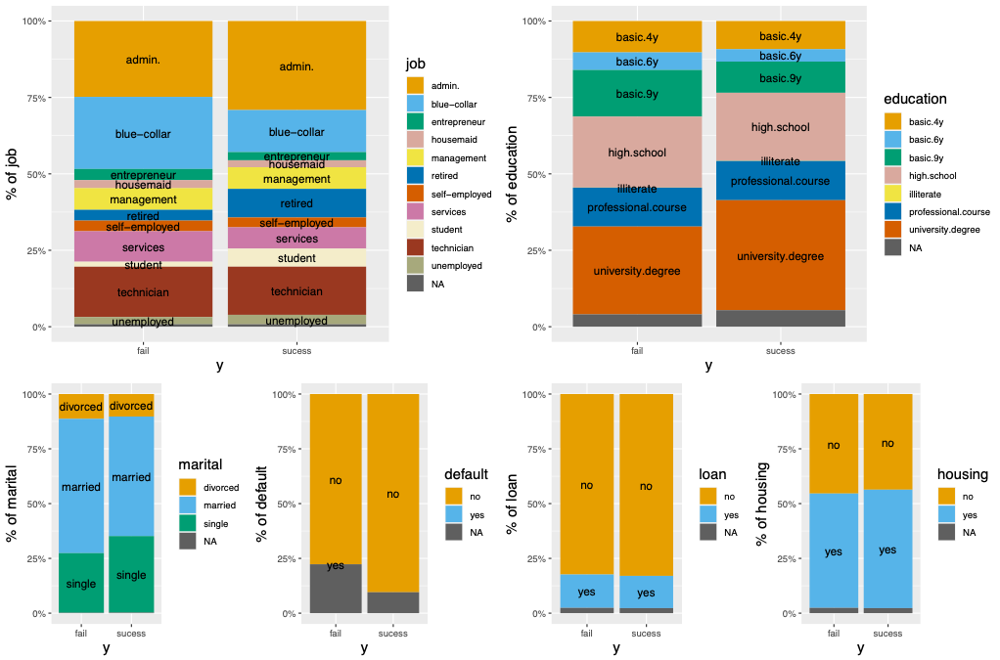

- Marital, Y Vs Job/Education/Housing:

    

#### Continuous variables

- Account Information
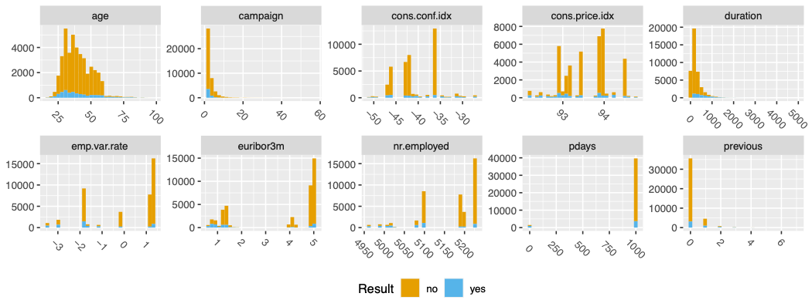

- Economics
    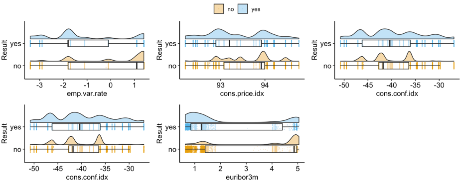

    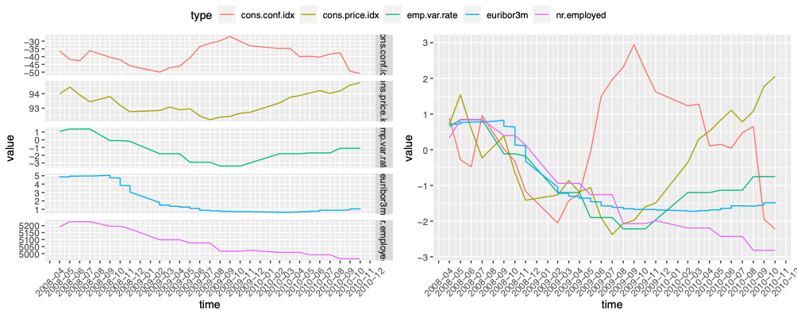

#### Combined

* Age vs job/education
    

### Feature Engineering/Selecting

#### Lable Encoding:

* Transform education type into education year:
    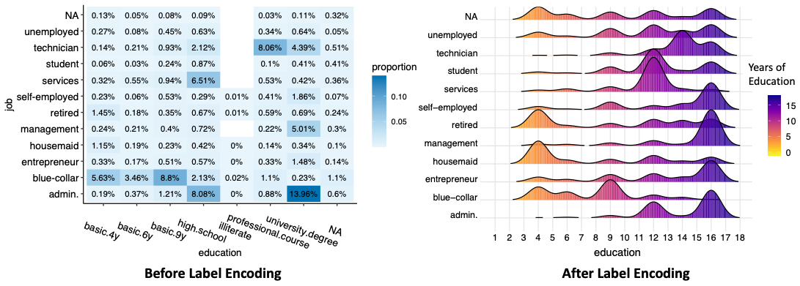

#### Extracted features:

* year features and monthly contact features from labelled `month`:

    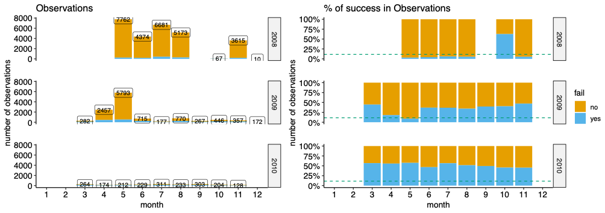

    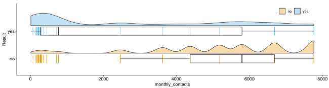

#### Delete/modify bad feature

* weekday of last contact:

    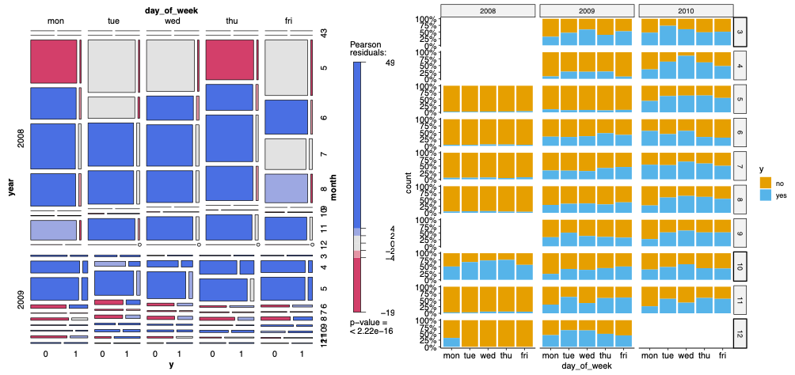

* previous and poutcome are similar, so just keep one.

    

### Missing value and ouliters handling:

We used `Random Forest`, `Pmm linear prediction`, 
`mode/Average`, and combined them.

## Modelling

We used Logistics, SVM and decision tree.

Results:

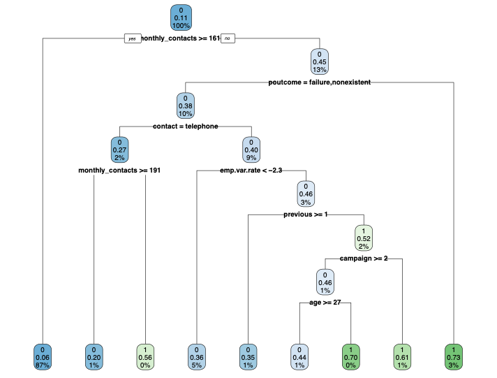

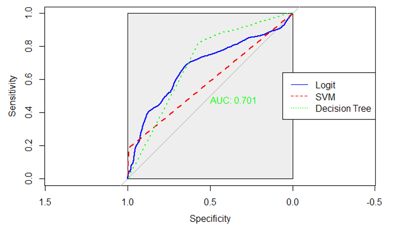